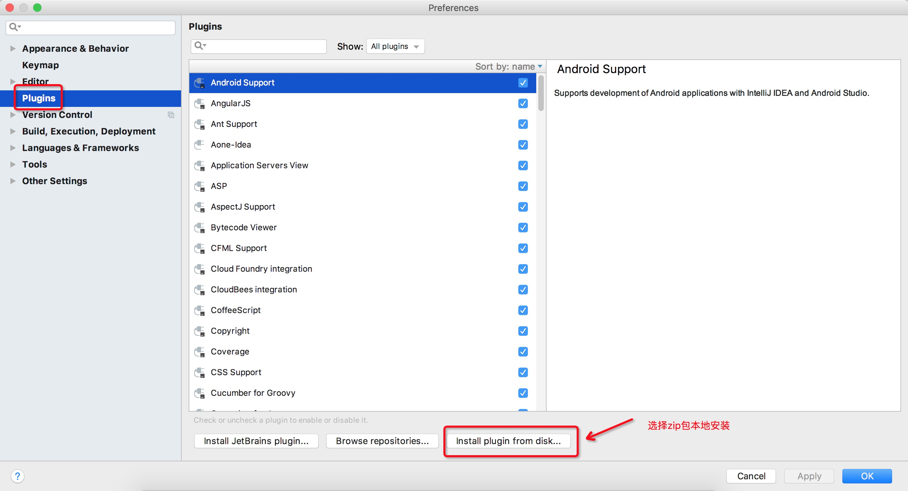
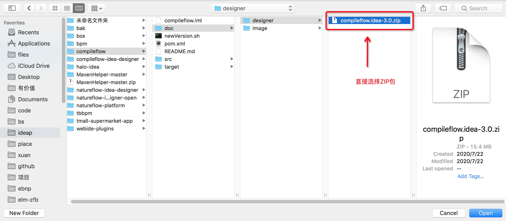

compileflow-idea-designer是一款Idea插件。能够让你轻松完成compileflow引擎的流程的编码设计和属性编辑。

compileflow引擎开源地址：https://github.com/alibaba/compileflow

# 简介

### 主要特性

* XML源文件预览：支持XML源文件编辑和预览
* 流程友好可视化：支持XML源文件转Swing图预览，以及导出图片到本地
* 流程友好可编辑：支持直接在Swing图画布中，拖拽节点，设计流程，以及编辑节点属性，全局属性等
* Java源码高量显示：流程最终会被编译成Java代码进行执行，设计器支持XML转Java代码的预览效果
* XML语法错误提示：如打开的XML源文件存在语法错误，会在Java源码预览区进行提示
* 扩展性：可方便扩展成支持BPMN协议

### 使用场景
* 设计业务逻辑流程图，并导出图片保存
* 设计编辑流程图，生成comileflow引擎所支持的XML源文件
* 预览已存在的XML源文件

### 设计目标
* 希望为业务开发提供端至端，从设计至实现的业务流程解决方案
* 提供多种流程引擎，实现从战略至商业能力，商业能力至业务流程，业务流程至系统，并最终实现业务的可视化全局架构
* 设计高效的执行引擎，实现对服务的快速组合或扩展，提升研发效率至极致

### 功能截图

> Java源码语法高亮

> 可视化流程编辑

> 可读性强的xml语法

> 节点属性编辑

# 快速开始

### ZIP包安装

1. 下载最新包到本地，下载地址:[compileflow-idea-designer.zip](doc/designer/compileflow-idea-designer-1.0.1.zip)
如果你是idea的2020版本及以上的，请下载这个:[compileflow-idea-designer.for.2020.up.zip](doc/designer/compileflow-idea-designer-1.0.1.for.2020.up.zip)
2. 使用本地安装的方式安装，注意安装整个zip不用手动解压  Preferences > Plugins > Install plugin from disk
  
  
3. 重启IDE. 查看.bpm文件就会生效

### 插件使用教程
* 新建BPM文件
    * STEP1：可在resources目录下创建，选中resources目录右键点击【Create New Bpm File】。例如我这边创建在resources的bpm目录下。
    
    * STEP2：输入文件名，例如：我这里的hello
    
    * STEP3：插件默认会生成了hello.bpm文件，是一个简单的开平方根demo流程，如下图
    
    
* 可视化编辑
  * STEP1：你可以选择下方【process-flow】进行可视化编辑，从左侧拖入节点到画布，或者选中节点拖动。
  
  - STEP2：双击空白处可编辑全局参数
  
  - STEP3：双击节点可以编辑节点参数（拖拽可调整节点位置）
  
  
* Java代码预览
  * STEP1：你可以选择下方【java code】进行Java代码预览。
  

* 创建测试代码
  * STEP1：选中文件右键，点击【Create New Bpm JUnit Test】可自动生成测试类
  
  * STEP2：到指定路径查看生成的测试类（修改入参数运行整个demo就完成了）
   

# Changelog

* 首发版本：1.0.0（2020.08.16）by xuan
* 优化功能：1.0.1（2020.08.17）by xuan
    * 友好提示绘图模式和编辑模式状态下，如何有效设置节点属性
    * 新增画布放大缩小功能

# 附录

### idea plugin 开发学习资料

1. [IntelliJ Platform SDK DevGuide](https://www.jetbrains.org/intellij/sdk/docs/welcome.html)
2. [jgraph学习资料](https://jgraph.github.io/mxgraph/docs/tutorial.html)
3. [miglayout学习资料](http://www.miglayout.com/whitepaper.html)
4. [java SWING学习资料](https://docs.oracle.com/javase/tutorial/uiswing/components/table.html)
5. [SDK build number](http://www.jetbrains.org/intellij/sdk/docs/basics/getting_started/build_number_ranges.html)
6. 入门demo：https://github.com/xuan698400/compileflow_demo
7. 我们能从InteliJ IDEA中学到什么？ https://developer.aliyun.com/article/696827
8. 编程10年感悟：https://www.infoq.cn/article/YD-tGFJPdGMVluYIkcc0 

### 版本升级备注

1. build.gradle 修改version和changeNotes
2. plugin.xml 修改version
3. README.md 修改记录Changelog
4. CompileFlow.java 修改version

# 欢迎联系我们

1. 请钉钉联系 @徐工 @余苏 @梵度 @哲良  @无相
2. 问题反馈邮箱：xuan.xa@alibaba-inc.com