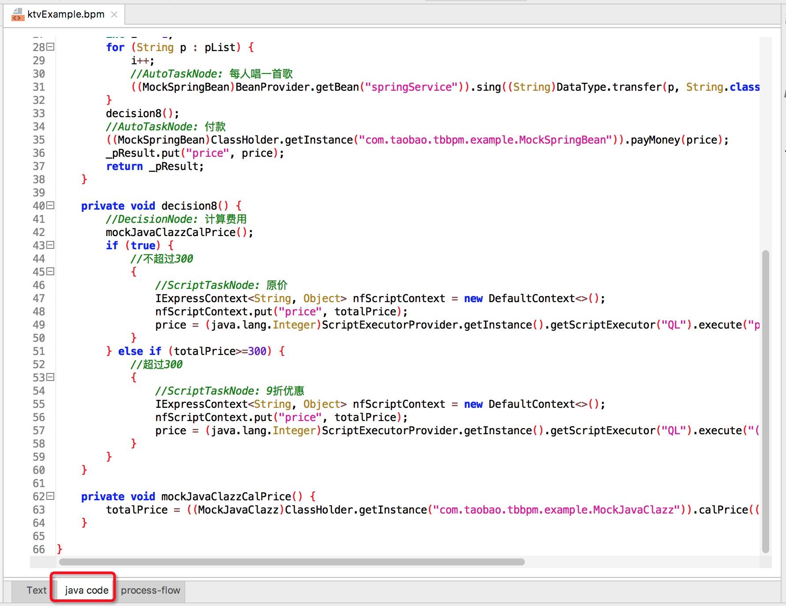
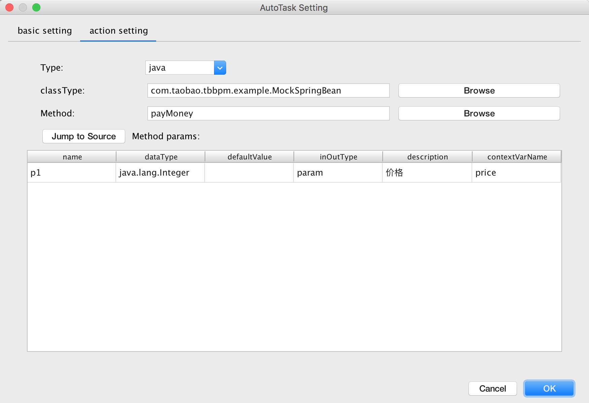
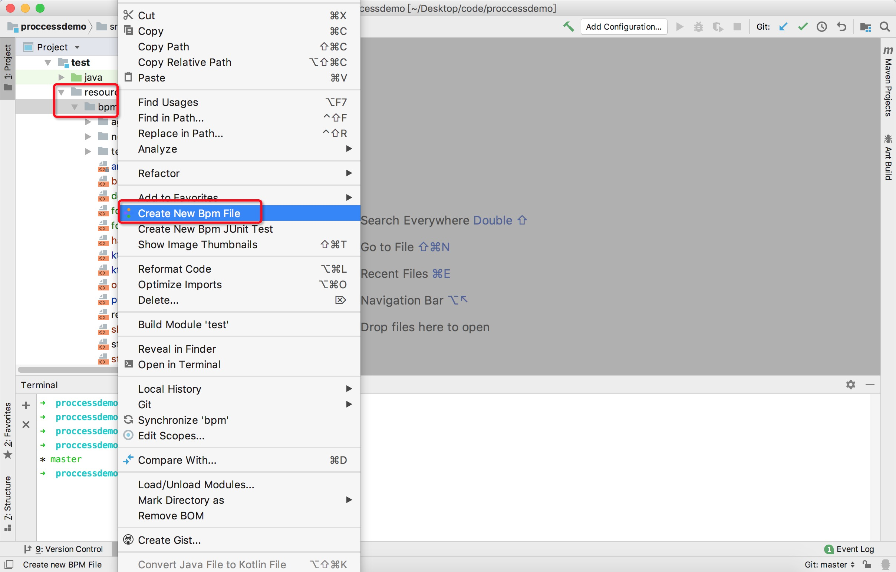
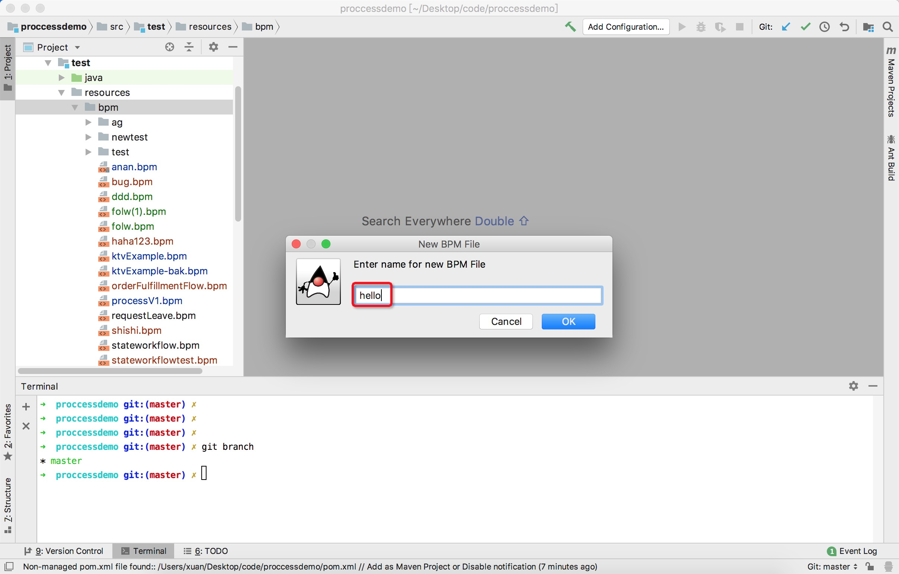
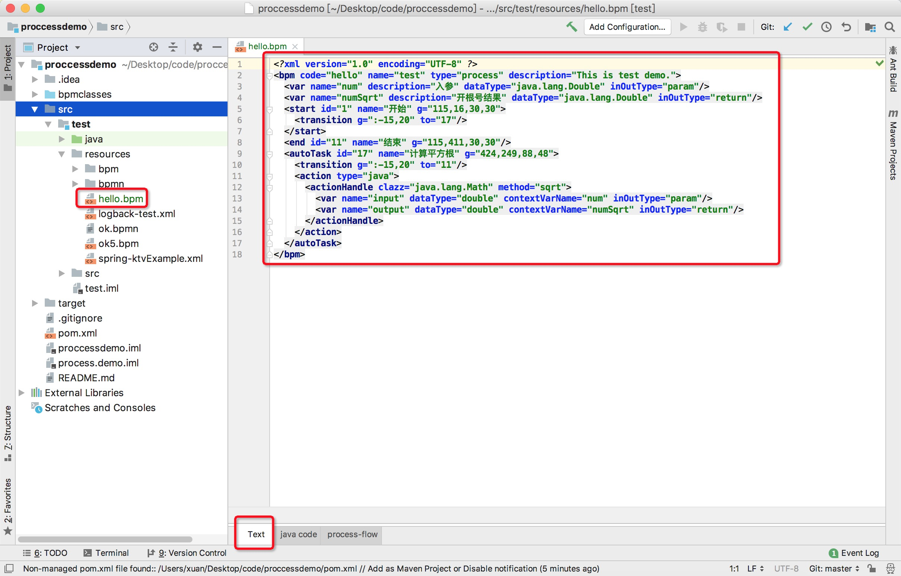
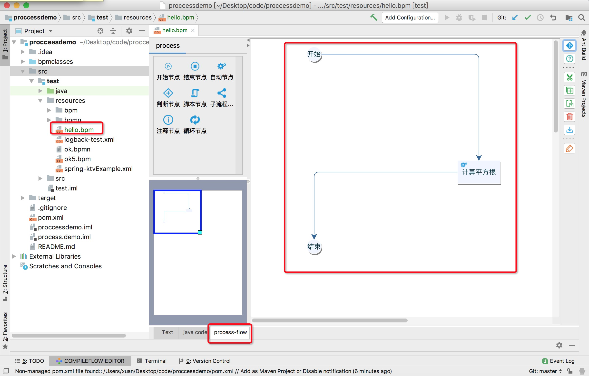
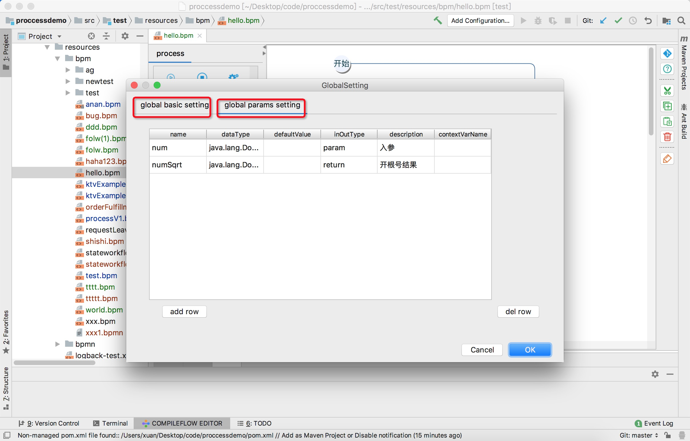
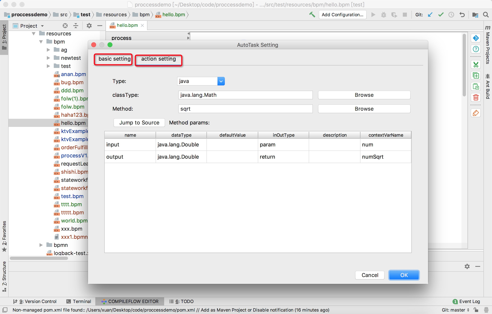
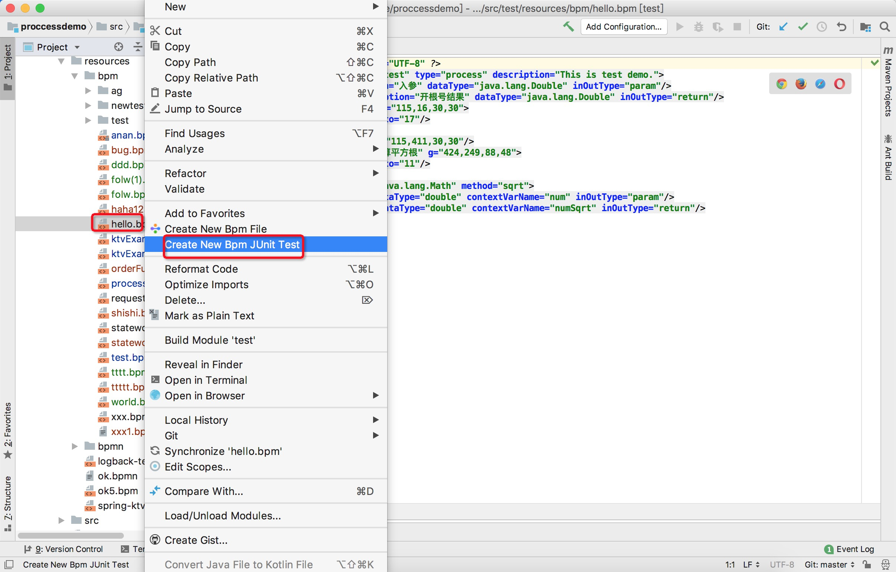
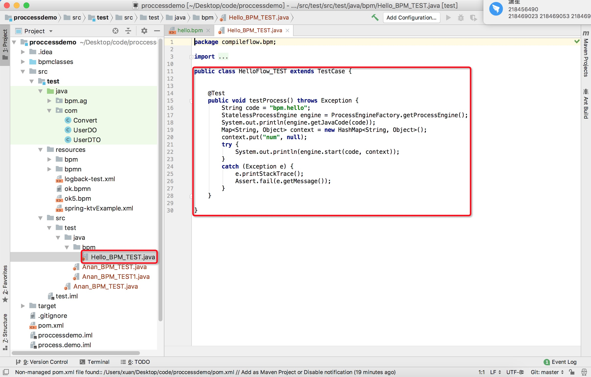

# compileflow-idea-designer

📖 English Documentation | [📖 中文文档](README_CN.md)

# What is it?
compileflow-idea-designer is an Idea plug-in. It allows you to easily complete the coding design and attribute editing of the compileflow engine process.

Compileflow engine open source address: https://github.com/alibaba/compileflow

Download the latest plug-in installation package, download address: compileflow-idea-designer.zip If you are the 2020 version of idea and above, please download this: compileflow-idea-designer.for.2020.up.zip

# Description
## Main features
XML source file preview: supports editing and previewing XML source files

Process-friendly visualization: support XML source files to Swing diagram preview, and export pictures to local

Process-friendly and editable: Support drag and drop nodes directly in the Swing diagram canvas, design process, and edit node attributes, global attributes, etc.

High-volume display of Java source code: the process will eventually be compiled into Java code for execution, and the designer supports the preview effect of XML to Java code

XML syntax error prompt: If there is a syntax error in the opened XML source file, it will be prompted in the Java source code preview area

Extensibility: can be easily extended to support BPMN protocol

# Usage Scenario
Design the business logic flow chart, and export the picture to save;
Design and edit flowcharts, generate XML source files supported by the compileflow engine;
Preview existing XML source files

# Design Target

Provide an end-to-end business process solution from design to execution of business development ideas.

Offer a variety of process engines to realize the visual global architecture, so that strategy easily translates to visualizations, which lead to enhanced business capabilities, processes and system.

Design an efficient execution engine that can support the company's rapid deployment of new services, and capable of streamlining processes that accelerate the development response and interaction speed.

# Function Screen
> Visual code

> Visual process

> Visual xml

> Node edit

# Quick Start
## ZIP Installation
Download the latest package to the local, download link, please scroll to the top of the page;

Use the local installation method to install, pay attention to install the entire zip without manually decompressing:Preferences > Plugins > Install plugin from disk;

Restart the IDE. View the .bpm file and it will take effect;

# Plug-in tutorial
New BPM file

STEP1: It can be created in the resources directory, select the resources directory and right-click [Create New Bpm File]. For example, I created it in the bpm directory of resources.

STEP2: Enter the file name, for example: hello inside the red box

STEP3: The plug-in will generate the hello.bpm file by default, which is a simple square root extraction demo process, as shown below

Visual editing

STEP1: You can select [process-flow] below for visual editing, drag the node from the left to the canvas, or select the node and drag it.

STEP2: Double-click the blank space to edit global parameters

STEP3: Double-click the node to edit the node parameters (drag and drop to adjust the position of the node)

Java code preview

STEP1: You can select [java code] below to preview the Java code. Syntax highlighting

Create test code

STEP1: Right-click the file and click [Create New Bpm JUnit Test] to automatically generate test classes

STEP2: Go to the specified path to view the generated test class (modify the input parameters and run the entire demo to complete)

# Changelog
* First release version: 1.0.0 (2020.08.16) by xuan
* Optimization function: 1.0.1 (2020.08.17) by xuan
    * Friendly tips on how to effectively set node attributes in drawing mode and editing mode
    * Add canvas zoom in and zoom out function
* Optimization function: 1.0.2（2020.09.07）by xuan
    * Node use English

# Appendix
idea plugin development learning materials

1. [IntelliJ Platform SDK DevGuide](https://www.jetbrains.org/intellij/sdk/docs/welcome.html)
2. [Jgraph Learning materials](https://jgraph.github.io/mxgraph/docs/tutorial.html)
3. [Miglayout Learning materials](http://www.miglayout.com/whitepaper.html)
4. [Java SWING Learning materials](https://docs.oracle.com/javase/tutorial/uiswing/components/table.html)
5. [SDK build number](http://www.jetbrains.org/intellij/sdk/docs/basics/getting_started/build_number_ranges.html)
6. demo：https://github.com/xuan698400/compileflow_demo
7. What can we learn from intelij idea? https://developer.aliyun.com/article/696827
8. 10 years of programming experience: https://www.infoq.cn/article/YD-tGFJPdGMVluYIkcc0 

# Welcome to contact us

1. DingDing @徐工 @余苏 @梵度 @哲良  @无相
2. Feedback email：xuan.xa@alibaba-inc.com
3. compileflow交流群

